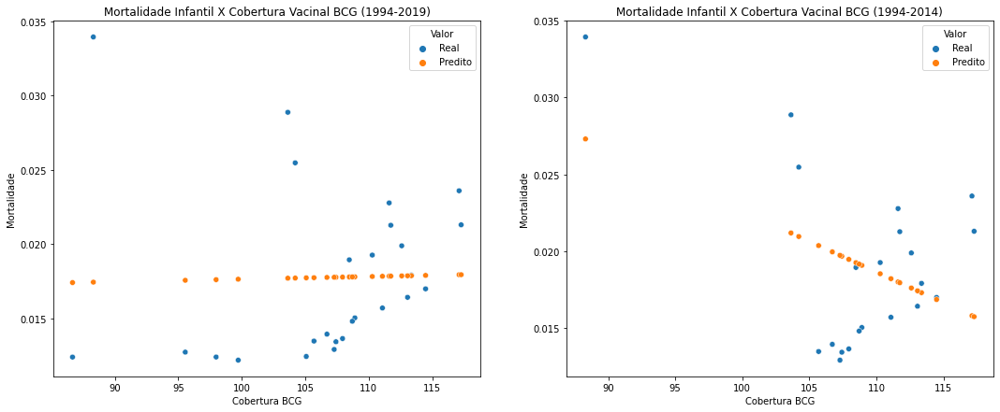
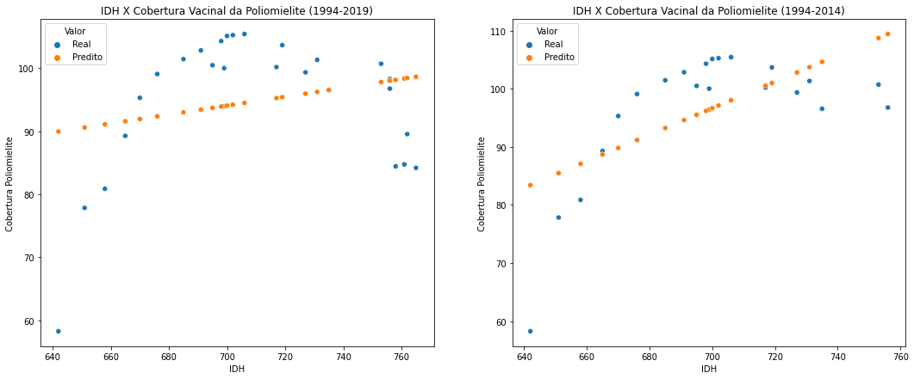

# Vaccine-immunology
Trabalho final da disciplina Ciência e Visualização de Dados em Saúde.

<strong>Projeto</strong> - Estudo da evolução de cobertura vacinal no Brasil.

<strong>Project</strong> - Study of the evolution of the vaccine coverage in Brazil.

~~~
├── README.md          			<- Apresentação do projeto.
│
├── assets
│   ├── artigos        			<- Artigos utilizados como referência para o projeto.
│   └── slides         			<- Slides utilizados na apresentação do projeto.
|
├── data
│   ├── processed      			<- Dados finais usados para a modelagem.
│   └── raw            			<- Dados originais sem modificações.
│
├── notebooks          			<- Jupyter notebooks.
|   ├── old				<- Arquivos antigos feitos no Colab (Python).
|   ├── E2_vaccine_immunology.ipynb	<- Versão anterior do projeto
|   └── E3_vaccine_immunology.ipynb	<- Versão Final do projeto
│
└── images             			<- Imagens geradas durante o desenvolvimento do projeto.
    └── README.md      			<- Instruções básicas de instalação/execução.
~~~

# Apresentação

O presente projeto foi originado no contexto das atividades da disciplina de pós-graduação Ciência e Visualização de Dados em Saúde, oferecida no primeiro semestre de 2021, na Unicamp.

   
Nome | RA | Especialização
----- | ----- | -----
Bruna Mezzari Carlos             | 235624 | Física Médica
Jean Antonio Ribeiro             | 265739 | Computação
Kellen Natalice Vilharva         | 235493 | Saúde
Roberto Junio de Almeida Candian | 214572 | Saúde

# Descrição Resumida do Projeto

    
   <strong>Tema do projeto:</strong> Considerando a complexa interação do sistema imunológico com diversos patógenos, a utilização das vacinas, para prevenir doenças infecciosas, representam grande triunfo para a ciência. A imunização por meio das vacinas, permitiram redução significativa de incidência de doenças, além da erradicação de outras. O projeto visa entender como a cobertura vacinal no Brasil evoluiu ao longo das últimas décadas, e quais os possíveis fatores que podem estar associados a essa evolução.
   
   <strong>Contexto gerador e motivação:</strong> Percepção da diminuição da cobertura vacinal ao longo dos últimos anos, cuja causa pode estar associada a diversos fatores sociais, econômicos e de saúde global.
   
   <strong>Key words:</strong> 1. cobetura vacinal 2. imunização
    

# Vídeos do Projeto

## Vídeo da Proposta
> Link para vídeo de apresentação da proposta do projeto (máximo 3 minutos).

   https://youtu.be/riO6BU0K5MU

## Vídeo da Apresentação Final
> Link para vídeo da apresentação final do projeto (máximo 8 minutos).

# Slides do Projeto

## Slides da Proposta
> Link para slides de apresentação da proposta do projeto.

<!-- https://github.com/JeanKusanagi/E1--Vaccine-immunology/tree/main/assets/slides/vacina-v1.pptx -->
https://github.com/JeanKusanagi/E1--Vaccine-immunology/tree/main/assets/slides/vacina_v1.pdf

<!-- também [implementado no Gephi](https://github.com/gephi/gephi/wiki/PageRank) -->
<!-- por meio do Gephi [12](https://gephi.org/). -->

## Slides da Apresentação Final
> Link para slides da apresentação final do projeto.

<!-- https://github.com/JeanKusanagi/E1--Vaccine-immunology/tree/main/assets/slides/vacina_final.pptx -->
https://github.com/JeanKusanagi/E1--Vaccine-immunology/tree/main/assets/slides/vacina_final.pdf

# Introdução e Referenciais de Teóricos
<!--
> Contextualização do projeto
>
> Caracterização do problema
>
> Motivação
>
> Relevância
>
> Trabalhos relacionados
>
> Indicação (bastante resumida) da análise proposta
>
> Indicação (bastante resumida) dos resultados alcançados
-->

O tipo de vacina mais comum é a utilização da versão atenuada do vírus ou bactéria, sendo que os primeiros indícios na história da utilização desse tipo de imunização remontam ao século 10, na China. Nesta época a aplicação se dava de forma bem diferente da que conhecemos atualmente, e somente em 1798, pela experiência do cientista Edwar Jenner, que o termo "vacina" foi criado. Por meio da observação de que trabalhadores rurais que já tinham sido acometidos pela varíola bovina não eram contaminados pela variante que afetava humanos, Edwar Jenner realizou um experimento inoculando o vírus em uma criança de oito anos de idade. Dessa forma, foi possível atestar experimentalmente a eficácia desse procedimento para a imunização. A partir de resultados satisfatórios consecutivos, o conceito da vacina foi reconhecido e generalizado para diversas doenças, sendo atualmente uma das principais e mais efetivas formas de imunização e prevenção de doenças no mundo (RIEDEl, 2005). 

Por meio da vacinação, doenças como a varíola, a poliomielite, o sarampo e a rubéola foram erradicadas nas últimas décadas no Brasil. Contudo, o sucesso das campanhas de vacinação está ameaçado com o surgimento da crescente onda de movimento antivacina (MORAN et al., 2016). Além disso, um colapso socioeconômico, como ocorrido na Venezuela, em associação com mudanças climáticas, falhas agrícolas, insegurança alimentar e urbanização, também pode estar relacionado ao surgimento de doenças já erradicadas, como o surto de sarampo ocorrido durante os anos de 2018 e 2019 no Brasil e em outros países (HOTEZ, 2020). Além desses fatores, a pandemia do COVID-19 pode estar contribuindo para essa queda na cobertura de imunização, tendo em vista o risco de contrair o coronavírus SARS-CoV-2, pelas pessoas ficarem reclusas em casa, além de postos de vacinação com horários reduzidos ou até mesmo fechados (FIGUEIRA et al., 2012). Sendo assim, o país pode voltar a ser acometido por doenças imunopreveníveis que estavam controladas diante do comprometimento da cobertura vacinal. Portanto, a vacinação é um tema estratégico de extrema importância ao se tratar de saúde pública e bem estar da população, sendo uma das formas de prevenção mais seguras e eficazes para redução da incidência de doenças contagiosas além de reduzir a utilização do sistema de saúde.   

# Perguntas de Pesquisa

   * Como ocorreu a evolução da cobertura vacinal das vacinas obrigatórias, ao longo dos anos e regiões do Brasil? 
   * Quais fatores regionais ou sociais podem estar associados ao aumento ou diminuição da cobertura vacinal?

# Objetivos do Projeto
O objetivo do projeto foi de realizar primeiramente uma análise exploratória para identificar se a cobertura vacinal dos principais imunizantes realmente diminuiu ao longo dos últimos anos, e se esse comportamento é o mesmo entre as regiões do Brasil. Essa análise também foi estendida para comparar a evolução da cobertura vacinal no Brasil com demais continentes. Também tivemos como objetivo analisar a relevância da cobertura vacinal de certos imunizantes para a redução da mortalidade infantil e aumento da expectativa de vida, além de comparar a evolução do Índice de Desenvolvimento Humano (IDH) brasileiro com a cobertura vacinal dos mesmos imunizantes. 

<!--  * Analisar a cobertura das vacinas obrigatórias ao longo dos anos no Brasil e e alguns outros países do exterior. -->
<!--   * Analisar a associação entre algumas regiões do Brasil com diversas doenças infecciosas. -->
<!--   * Encontrar particularidades no Brasil que permitam identificar quais a regiões mais afetadas pela falta de imunização. -->

# Metodologia
> Abordagem adotada pelo projeto na busca pela resposta às perguntas de pesquisa.
> Justificar teoricamente, sempre que possível, a metodologia adotada.
<!--    Proposta de metodologia incluindo especificação de quais técnicas pretende-se explorar, tais como: aprendizagem de máquina, análise de redes, análise estatística, ou integração de uma ou mais técnicas. Para a primeira entrega, descreva de maneira mais genérica que tipo de abordagem seu grupo pretende realizar. -->
    
   Este trabalho foi desenvolvido sobre as seguintes bases de dados:

   * DATASUS é o departamento de informática do Sistema Único de Saúde do Brasil. Esse órgão administra informações de saúde como indicadores de saúde, assistência à saúde, informações epidemiológicas e de morbidade, informações sobre a rede de assistência à saúde, estatísticas vitais, informações demográficas e socioeconômicas. Também administra informações financeiras referentes aos recursos do Fundo Nacional de Saúde transferidos aos municípios, aos créditos aos prestadores de serviços de saúde, aos orçamentos públicos de saúde declarados pelos Estados, pelo Distrito Federal e pelos Municípios. Também é responsável pelos sistemas e aplicativos necessários para registrar e processar as informações de saúde. Os sistemas de saúde administrados pelo Datasus ainda não são integrados entre si. 

   * O Global Health Observatory (GHO) é uma iniciativa da Organização Mundial da Saúde para compartilhar dados online sobre saúde, incluindo estatísticas por país e informações sobre doenças específicas e medidas de saúde. Os temas, apresentados no site da organização, incluem objetivos de Desenvolvimento do Milênio, estimativas de mortalidade e saúde global, sistemas de saúde, saúde pública e meio ambiente, Health Equity Monitor, estrutura de monitoramento do Regulamento Sanitário Internacional, saúde urbana, mulheres e saúde, doenças não transmissíveis,uso de substâncias e saúde mental, doenças infecciosas e lesões e violência.

   * O Relatório do Desenvolvimento Humano (RDH) é uma publicação anual realizada pelo Programa das Nações Unidas para o Desenvolvimento (PNUD). O objetivo desse órgão é colocar as pessoas no centro do processo de desenvolvimento em termos de debate econômico, político e jurídico. O desenvolvimento foi caracterizado pela prestação de escolhas e liberdades resultando em ampla resultados.  Entre os índices presentes na base, destacam-se Índice de Desenvolvimento Humano, o Índice de Desenvolvimento em relação ao gênero, a Medida de Capacidade de Gênero e o Índice de Pobreza Humana. Cada um tem o seu próprio relatório tendo por base debates contemporâneos. O Relatório do Desenvolvimento Humano é um relatório independente, encomendado pelo PNUD, elaborada por líderes acadêmicos, profissionais e membros do Gabinete do Relatório do Desenvolvimento Humano do PNUD.
   
   O projeto será elaborado a partir do modelo CRISP-DM. Com a utilização de dados fornecidos pelas bases de dados, a modelagem será realizada por meio de gráficos, correlação entre os dados e séries temporais. Também serão utilizados Métodos de Regressão para a predição de informações, utilizando a linguagem de programação Python. As setas apresentadas, na figura abaixo, indicam o caminho mais comum durante a realização das tarefas em cada uma das etapas do modelo CRISP, contudo em teoria a qualquer momento do ciclo é possível voltar para quaisquer uma das etapas anteriores, como ocorreu neste projeto.
   
   <figure>
	
	<!--<figcaption>Modelo CRISP-DM</figcaption>-->
   </figure>
   <small>Fonte: https://www.datascience-pm.com/crisp-dm-2/</small>

 

# Bases de Dados e Evolução

### Bases Estudadas e Adotadas
    
Database | Endereço na Web|Resumo descritivo
----- | ----- | -----
|DATASUS  | http://tabnet.datasus.gov.br/cgi/dhdat.exe?bd_pni/cpnibr.def | Departamento de informática do Sistema Único de Saúde do Brasil, o Datasus administra informações de saúde e informações financeiras. |
<!--| Bigdata  | https://bigdata.icict.fiocruz.br | Lançada em 2016, a PCDaS é uma iniciativa do Laboratório de Informação em Saúde (Lis) e do Centro de Tecnologia da Informação e Comunicação em Saúde (Ctic), ambos do Instituto de Comunicação e Informação Científica e Tecnológica em Saúde (Icict) da Fundação Oswaldo Cruz (Fiocruz), em parceria com o Laboratório Nacional de Computação Científica (LNCC), tem como objetivo desenvolver e disponibilizar Plataforma de Ciência de Dados aplicada à Saúde pública e gratuita com utilização de ferramentas open source para armazenamento, gestão, análise e disseminação de grandes quantidades de dados de saúde e seus determinantes socioambientais para pesquisadores, docentes e discentes de instituições de ensino e pesquisa, bem como gestores governamentais. |-->
Todas as tabelas, armazenadas em arquivos 'csv', possuíam a mesma quantidade de valores em cada coluna, mesmo que seja o valor 0. Contudo, na última linha de cada tabela, possui um valor representando a soma total de todos os valores da respectiva coluna. As transformações e tratamentos necesssários para obter uma nova base de dados que possa ser manipulada, de forma que se possa obter informações úteis e, posteriomente, serem analisadas, foram:
   
   * Remoção de linhas com dados categóricos, no caso, somente a última linha de todas as tabelas foram retiradas. Nessa linha, havia as representações totais de cada coluna. No caso da última célula, na coluna de nome 'Ano', seu valor é do tipo string igual a 'Total'. Os restantes das células, para todas as tabelas, são do tipo numérico.
   * Alguns dos valores numéricos possuiam o caractere ',' e, por isso, foram trocados pelo caractere '.'. Essa abordagem foi realizada para que a biblioteca pandas pudesse ler os dados dos arquivos 'csv' e, em seguida, manipulá-los.
   * Para muitos imunizantes não haviam dados de todos os anos (1994-2020), pois a cobertura vacinal era 0. Foram considerados para as análises somente os imunizantes com nenhum ou poucos valores nulos. Para alguns anos e imunizantes, a cobertura vacinal é maior do que 100% (mais de 100% da população alvo estimada foi imunizada).

  Um formulário básico que deve ser capaz de orientar o leitor na estruturação de informações em etapas de entendimento dos dados são encontrados ([ver aqui](data/raw/vaccine-immunology/notatecnicaCobertura.pdf)) e ([ver aqui](data/raw/vaccine-immunology/info.txt)).
  
  A descrição de todas as operações realizadas, para reestruturação e análises realizadas durante o desenvolvimento deste projeto, podem ser conferidas no notebook gerador dos agrupamentos ([ver aqui](notebooks/E2_vaccine_immunology.ipynb)).
  
  Na análise exploratória inicial, foram feitos gráficos de correlação, boxplot e evolução temporal: 
   
   * Cobertura vacinal no Brasil 1994 - 2020:

   <figure>
	
	<!--<figcaption>Legenda para a imagem impressionante</figcaption>-->
   </figure>
   
   <figure>
	
	<!--<figcaption>Legenda para a imagem impressionante</figcaption>-->
   </figure>
    
 
   * Cobertura BCG no Brasil 1994 - 2020:
   
   <figure>
	
	<!--<figcaption>Legenda para a imagem impressionante</figcaption>-->
   </figure>
   

   * Cobertura Poliomielite no Brasil 1994 - 2020:
   
   <figure>
	
	<!--<figcaption>Legenda para a imagem impressionante</figcaption>-->
   </figure>
   
   <figure>
	
	<!--<figcaption>Legenda para a imagem impressionante</figcaption>-->
   </figure>
   
   
   
   * Cobertura Hepatite B no Brasil 1994 - 2020:

   <figure>
	
	<!--<figcaption>Legenda para a imagem impressionante</figcaption>-->
   </figure>
   
   
   * Cobertura DTP no Brasil 1994 - 2016 (sem info no ano de 2003):

   <figure>
	
	<!--<figcaption>Legenda para a imagem impressionante</figcaption>-->
   </figure>
   
A partir destas análises exploratórias, foi possível identificar que há um movimento de queda das coberturas vacinais a partir de 2015 para todos os imunizantes considerados. Essa queda ocorre logo depois de um grande movimento de ascensão entre os anos de 1994 a 2014. Foi possível observar também que todas as regiões possuem médias maiores que 80 para todos os imunizantes, sendo que os municípios de extrema pobreza possuem em geral as menores médias e a região de maior média varia entre os imunizantes. A variação de valores das coberturas é maior nas regiões Norte, Nordeste, Amazônia Legal e municípios de extrema pobreza. Um comportamento similar entre essas regiões já era esperado, visto a proximidade geográfica e maior intersecção entre elas (Amazônia Legal e Norte, por exemplo). A partir dos gráficos de correlação foi possível identificar melhor as tendências de similaridade obtidas com os gráficos de boxplot. Novamente temos uma forte correlação entre Norte, Nordeste, Amazônia Legal, municípios de extrema pobreza e também o Semiárido. As regiões com menores correlações foram Sul e Norte, Sul e Centro-Oeste e Sul e Amazônia Legal para o imunizante BCG. Para os demais imunizantes, não houve nenhuma correlação abaixo de 0.5, e as tendências foram similares.
   
   

Database | Endereço na Web|Resumo descritivo
----- | ----- | -----
THE GLOBAL HEALTH OBSERVATORY | https://www.who.int/data/gho/data/themes/immunization | Iniciativa da Organização Mundial da Saúde para compartilhar dados sobre saúde global, incluindo estatísticas por país e informações sobre doenças específicas e medidas de saúde. O site da GHO é organizado em torno de temas. Para cada tema, as principais estatísticas são apresentadas na página da Web associada, e dados e relatórios mais detalhados estão disponíveis para download.
        
Com essa base de dados, foi possível obter os dados de cobertura vacinal de diversos imunizantes dos anos de 1980 a 2019. Foram pesquisados dados das vacinas BCG, Poliomielite, Hepatite B e DTP. A base fornece os dados por país, mas os datasets também possuem uma coluna indicando o continente ou macro-região global a qual o país pertence. Como o objetivo da análise era comparar o Brasil com índices gerais, escolhemos trabalhar com a média de cobertura entre continentes (países da Ásia e Oceania estavam divididos em regiões menores, então fizemos a média somente para Americas, África e Europa). Entre os dados escolhidos não haviam dados faltantes e os valores de cobertura vacinal (porcentagem da população-alvo corretamente imunizada) variam de 1 a 100.

A análise exploratória foi feita de forma integrada com os dados do DATASUS (item Integração entre Bases).

    

Database | Endereço na Web|Resumo descritivo
----- | ----- | -----
HDR | http://hdr.undp.org/en/data | Dataset com compilado de dados obtidos de diversas fontes para desenvolvimento em termos de pesquisa e análise, debate econômico, opções de políticas e advocacy. Nessa base são fornecidas informações sobre saúde, economia, educação e índices como o IDH (Índice de Desenvolvimento Humano) de diversos países do mundo.

Com essa base de dados, foi possível obter indicadores sociais e de saúde do Brasil para diferentes anos. Muitos dos indicadores escolhidos não possuem registros em todos os anos considerados pela base de dados, ou possuem somente registros periódicos (a cada 5 anos). Dos possíveis indicadores que poderiam estar relacionados com a cobertura vacinal e que possuíam registros no período 1994-2019, escolhemos para analisar os seguintes:

 * IDH : medida de desenvolvimento humano, em especial nos setores de educação (education index), renda (PIB per capita) e longevidade (expectativa de vida). Varia entre 0 e 100, sendo 100 correspondente a um país bastante desenvolvido. 
 * Education index: leva em conta o número médio de anos escolares de pessoas com mais de 25 anos. Varia entre 0 e 1, sendo que um índice 1 indicaria que todos os adultos acima de 25 anos receberam 18 ou mais anos de educação formal.

A análie exploratória foi feita integrada com os dados do DATASUS (item Integração entre Bases).

### Integração entre Bases e Análise Exploratória

 * Integração entre a base GLOBAL HEALTH OBSERVATORY e DATASUS: nessa etapa da análise, integramos as médias de cobertura vacinal dos continentes às coberturas vacinais do Brasil e regiões do Brasil (Sul, Norte, Sudeste, ...), criando datasets 'imuno_mundo_br' com todos os dados de 1994 a 2019. Como a cobertua vacinal na base de dados internacional assume valores de 1 a 100, os valores de cobertura acima de 100 oriundos da base Brasileira foram redefinidos como 100. Na análise exploratória inicial, foram feitos gráficos de correlação, boxplot e evolução temporal, como exemplificado a seguir:

   <figure>
	
	<!--<figcaption>Legenda para a imagem impressionante</figcaption>-->
   </figure>
   
   <figure>
	
	<!--<figcaption>Legenda para a imagem impressionante</figcaption>-->
   </figure>
   
   O gráfico de boxplot para a poliomielite permite identificar que as médias de cobertura vacinal são similares entre Europa, Américas e Brasil sendo que a África possui a menor média e o Brasil, a maior. Entretanto, a variação de valores para o Brasil é alta comparada com as variações de Europa e Américas, e similar à varição da África. Essa variação maior já era esperada visto que os dados dos continentes representam médias sobre os países, mas ainda assim o continente Africano apresentou grande variação. Esse comportamento é refletido nas correlações, onde temos que o Brasil com correlações altas entre Europa e Américas, e correlação baixa com a África. No gráfico de evolução temporal, é interessante observar o comportamento de ascensão da cobertura vacinal no Brasil entre 1995-2000 em comparação com os demais. A variação para esse período é de mais de 40 para o Brasil, enquanto que para os continentes não passa de 10. Podemos ver também que o comportamento de queda dos últimos anos ocorre com maior força somente no Brasil.
  
   
 * Integração entre a base HDR e DATASUS: nessa etapa da análise, integramos o índice IDH (obtido da base HDR) aos dados de número total de óbitos de crianças abaixo de 1 ano, número de nascidos vivos, expectativa de vida (em anos) e cobertura vacinal dos imunizantes BCG, Poliomielite, Hepatie B, DTP e Febre Amarela (obtidos do DATASUS) no período de 1994-2019. Na base HDR, as linhas representam os países e as colunas, os anos. Para manter a formatação utilizada dos demais dataframes, invertemos as matrizes de dados oriundas da HDR para o formato Ano x País e, em sequência, selecionamos somente a coluna com os dados do Brasil. Para gerar os dados de mortalidade infantil realizamos o seguinte cálculo para cada ano, de acordo com (Yunes J., Ronchezel V. S., 1974).
 Mortalidade (de crianças abaixo de 1 ano) = Número total de óbitos (de crianças abaixo de 1 ano) / Número de nascidos vivos. 
 
 Na análise exploratória inicial, foram feitos gráficos de correlação, evolução temporal e scatter como exemplificado a seguir:

   <figure>
	
	<!--<figcaption>Legenda para a imagem impressionante</figcaption>-->
   </figure>
   
   <figure>
	
	<!--<figcaption>Legenda para a imagem impressionante</figcaption>-->
   </figure>
   
   <figure>
	
	<!--<figcaption>Legenda para a imagem impressionante</figcaption>-->
   </figure>

A partir do gráfico de correlação e dos gráficos temporais foi possível identificar uma correlação fortemente negativa entre mortalidade infantil e expectativa de vida, bem como correlações fortemente positivas entre IDH e expectativa de vida e negativa entre IDH e mortalidade infantil, como esperado. As correlações com a cobertura vacinal da poliomielite não são tão fortes, mas indicam que há correspondência positiva com o IDH e expectativa de vida, e negativa com mortalidade infantil. A partir dos gráficos de scatter podemos entender porque a correlação da cobertura vacinal não é tão forte. Apesar de haver uma tendência de decréscimo na mortalidade e aumento do IDH com o aumento da cobertura vacinal, existem pontos de alto IDH e baixa mortalidade correspondentes a valores menores de cobertura vacinal. Esses pontos podem estar em duas categorias, podendo ser outliers (pontos calculados erroneamente) ou serem correspondentes aos últimos anos, onde houve decréscimo na cobertura da poliomielite.

A descrição de todas as operações realizadas nesta etapa também podem ser conferidas no notebook gerador dos agrupamentos ([ver aqui](notebooks/E2_vaccine_immunology.ipynb)).   

# Análises Realizadas

As análises realizadas consistiram em 3 categorias: análise exploratória (elaboração de gráficos de boxplot, correlação e de evolução temporal, cálculos de médias e desvio padrão), teste de hipóteses e regressão linear. A análise exploratória foi realizada utilizando as bibliotecas da linguagem _Python_ Numpy e Pandas (para manejo dos dados e cálculos de média, desvio padrão e correlação) e Matplotlib e Seaborn (para resultados gráficos). Para os testes de hipóteses e regressão linear, utilizamos as bibliotecas SciPy e Scikit-Learn, respectivamente, e as mesmas bibliotecas para geração de gráficos da análise exploratória. Todas as análises foram feitas no notebook gerador de agrupamentos ([ver aqui](notebooks/E3_vaccine_immunology.ipynb)).

As análises via teste de hipóteses consistiram em testar se diferentes regiões do Brasil e do mundo possuem distribuições estatisticamente distintas de cobertura vacinal dos imunizantes considerados nos períodos de 1994 a 2019 e 1994 a 2020. Um segundo tipo de teste de hipóteses seria feito para identificar se os municípios de extrema pobreza possuíam distribuição de coberturas diferente dos municípios sem extrema pobreza. Entretanto, ao manipular os dados percebemos que os dados gerados com o filtro 'Municípios de extrema pobreza = não' na plataforma do DATASUS eram idênticos aos dados de todo o Brasil (sem aplicação do filtro), e não foi possível fazer uma comparação direta (com/sem extrema pobreza). Por conta disso, fizemos o teste de hipóteses, comparando os municípios de extrema pobreza com as capitais do país.

Com as análises via regressão linear, o objetivo era de inicialmente identificar relações de dependência de diversos fatores sociais e econômicos com a cobertura vacinal dos principais imunizantes. Fatores que consideramos relevantes para essa análise seriam o IDH, mortalidade infantil, expectativa de vida, gastos em saúde pública, índices de educação e PIB. O índice de educação obtido pela base HDR, mortalidade infantil, expectativa de vida e PIB estão diretamente ligados ao cálculo do IDH, tornando a análise com mais de um desses fatores (ao mesmo tempo) redundante. Para o índice restante, gastos em saúde pública, que consideramos ser de extrema importância para análise, não foi possível obter dados coerentes para o período considerado. Encontramos dados de somente alguns anos na base HDR e dados também de somente alguns anos em resumos/reports do IBGE e outros órgãos governamentais, porém o cálculo dos gastos foi feito de forma distinta em cada arquivo e não foi possível utilizá-los. Realizamos então a análise por regressão linear em dois formatos: cobertura vacinal como preditor para a mortalidade infantil e IDH como preditor da cobertura vacinal, para os imunizantes da poliomielite, BCG e Hepatite B. Sabemos que a mortalidade infantil e a cobertura vacinal dependem de inúmeros fatores e portanto não é possível prever o comportamento desses dados na forma analisada, mas foi possível analisar tendências de comportamento entre os fatores de predição e os preditos.

# Ferramentas utilizadas

   
   O projeto foi elaborado com auxílio de gráficos, séries temporais e da linguagem de programação Python.
    
Ferramenta | Endereço na Web | Resumo descritivo e utilização
----- | ----- | -----
Google Colab 	 | https://colab.research.google.com | Lista de células que podem conter textos explicativos ou códigos executáveis e suas respectivas saídas.
Jupyter Notebook | https://jupyter.org/              | Documento que permite execução de rotinas usuais de programação e documentação de todo o processo de 								produção do código.
Matplotlib   	 | https://matplotlib.org            | Biblioteca do _Python_ para criação de gráficos e visualizações de dados.
Numpy        	 | https://numpy.org                 | Biblioteca do _Python_ orientada a operação de vetores e matrizes multidimensionais.
Pandas      	 | https://pandas.pydata.org         | Biblioteca do _Python_ orientada a manipulação e análise de dados.
Python 2.7.17 	 | https://www.python.org            | Linguagem de programação de propósito geral. 
Scikit-Learn     | https://scikit-learn.org/stable/  | Biblioteca do _Python_ para aprendizado de máquina. Utilizada para regressão linear.
SciPy            | https://www.scipy.org/            | Biblioteca/Ecossistema do _Python_ para análises científicas e estatísticas em geral. Utilizada para o 								teste de hipóteses.

# Resultados e Discussão

 * Brasil por região
   Abaixo, apresentamos uma tabela com as médias e desvio padrão (em parênteses) de cobertura vacinal durante o período 1994 - 2020 para as diferentes regiões do país

Região/Imunizante | Norte | Nordeste | Sudeste | Sul | Centro-Oeste | Municípios de Extrema Pobreza | Capitais | Brasil
----- | ----- | ----- | ----- | ----- | ----- | ----- | ----- | -----
BCG | 109.2 (14.6) | 107.0 (11.6) | 104.5 (10.4) | 102.0 (6.7) | 107.3 (13.0) | 95.6 (9.6) | 117.6 (14.7) | 106.7 (7.76)
Hepatite B | 75.8 (25.6) | 74.8 (37.3) | 81.6 (33.5) | 84.8 (24.5) | 78.8 (35.1) | 78.2 (37.1) | 75.9 (32.0) | 78.0 (33.5)
Poliomielite | 88.8 (19.8) | 93.2 (12.8) | 96.7 (8.2) | 95.0 (5.6) | 95.4 (16.0) | 94.9 (13.6) | 93.1 (10.7) | 94.1 (11.4)

Conforme é possível observar na tabela acima e também nos gráficos de boxplot da análise exploratória, as médias de cobertura vacinal não variam significativamente para as diferentes regiões do país. As médias das regiões norte, nordeste e municípios de extrema pobreza apresentam as menores médias, enquanto as demais regiões apresentam médias maiores e similares. A imunização contra a Hepatite B é a que apresenta menor cobertura dentre os imunizantes considerados. Apesar de não parecerem distintas, ainda assim realizamos os testes de hipóteses para verificar a proximidade das distribuições de cobertura vacinal entre as regiões do País. A tabela abaixo apresenta os valores p para a hipótese de que as distribuições da cobertura vacinal da poliomielite no par de regiões consideradas são estatisticamente indistinguíveis.

Como podemos observar, a distribuição de cobertura vacinal de nenhuma região é de fato estatisticamente independente. Os valores de comparação entre a região Norte e as demais são os menores, indicando que a cobertura nessa região parece ser a mais distinta (mas ainda assim nenhum valor é menor do que 0.05). Esses resultados indicam que o acesso às vacinas obrigatórias e de extrema importância no Brasil é bastante homogêneo (em média), mesmo em regiões de maior vulnerabilidade.

Brasil é considerado um dos países que possuem o maior calendário vacinal do mundo e possui o Programa Nacional de Imunização (PNI) desde 1975, que tem como objetivo coordenar as ações de imunizações no país (LIMA & PINTO, 2017). Atualmente o PNI é patrocinado pelo Sistema Único de Saúde (SUS), o SUS oferece cobertura de saúde para cerca de 75% da população, garantindo acesso gratuito a medicamentos, tecnologia em saúde, exames de saúde, imunizações e tratamentos (BRASIL, 2021)

Regiões | Valor p
----- | -----
Sul - Sudeste | 0.238
Sul - Centro-Oeste | 0.818
Sul - Norte | 0.168
Sul - Nordeste | 0.630
Sudeste - Centro-Oeste | 0.691
Sudeste - Norte | 0.0658
Sudeste - Nordeste | 0.228
Centro-Oeste - Norte | 0.208
Centro-Oeste - Nordeste | 0.608
Norte - Nordeste | 0.347
Capitais - Extrema pobreza | 0.591

Como podemos observar, a distribuição de cobertura vacinal de nenhuma região é de fato estatisticamente independente. Os valores de comparação entre a região Norte e as demais são os menores, indicando que a cobertura nessa região parece ser a mais distinta (mas ainda assim nenhum valor é menor do que 0.05). Esses resultados indicam que o acesso à vacinas obrigatórias e de extrema importância no Brasil é bastante homogêneo (em média), mesmo em regiões de maior vulnerabilidade. **Discussão sobre SUS/outros artigos**
   
  * Índices sociais e Cobertura Vacinal
  
A comparação da evolução da cobertura vacinal da Poliomielite, Hepatite B e BCG com a mortalidade infantil através do método de regressão linear produziu os resultados da tabela abaixo, que contém os valores de R2 e o coeficiente angular (em parênteses) encontrados considerando dois períodos distintos. O coeficiente R2 representa a proporção de variância da variável independente (nesse caso, a mortalidade) que é explicada pela variável preditora (cobertura vacinal) em um modelo de regressão, sendo que R2 = 1 indica que toda a variância da variável independente é explicada pela preditora, e R2 = 0 indica que nenhuma porção da variância é explicável pela predição.

Imunizante | 1994-2019 | 1994-2014
----- | ----- | -----
Poliomielite | 0.296 (-0.000279) | 0.694 (-0.000405)
BCG| 0.000570 (1.736e-05) | 0.190 (-0.000340)
Hepatite B | 0.649 (-0.000133) | 0.720 (-0.000127)

Abaixo, apresentamos os gráficos gerados após as regressões lineares, contendo os dados originais e preditos.

<figure>
	
	<!--<figcaption>Legenda para a imagem impressionante</figcaption>-->
   </figure>
   
 <figure>
	
	<!--<figcaption>Legenda para a imagem impressionante</figcaption>-->
   </figure>
   
  <figure>
	
	<!--<figcaption>Legenda para a imagem impressionante</figcaption>-->
  </figure>
   
Conforme observado já na análise exploratória, a cobertura vacinal dos principais imunizantes parece ter entrado em queda a partir dos anos de 2014 e 2015. Observando os resultados das regressões considerando todo o período de 1994 a 2019 e comparando com a evolução da mortalidade infantil, foi possível diagnosticar mais uma vez essa queda. É possível notar que valores de R quadrado ao final da regressão e os coeficientes lineares são menores para o período 1994-2014, indicando que nesse período há uma tendência mais forte de aumento na cobertura vacinal associada à diminuição da mortalidade infantil. O gráfico para a cobertura da BCG é o que possuí os dados mais dispersos, e isso é explicado ao analisar a evolução temporal desse parâmetro, onde vemos que esse imunizante apresenta uma boa cobertura (maior que 100) por quase todo o período analisado, não havendo uma tendência tão grande de crescimento em comparação com as demais. **Discussão**

As regressões lineares utilizando o IDH como preditor da cobertura vacinal apresentaram resultados similares, no sentido de indicarem também a tendência de decrescimento das coberturas vacinais a partir do ano de 2014. Abaixo, apresentamos uma tabela com os valores de R2 e coeficiente angular da reta (em parênteses) para cada imunizante considerado, em dois períodos de tempo. 

Imunizante | 1994-2019 | 1994-2014
----- | ----- | -----
Poliomielite | 0.0584 (0.0707) | 0.399 (0.228)
BCG| 0.110 (-0.0683) | 0.0282 (0.0322)
Hepatite B | 0.466 (0.619) | 0.624 (0.928)

Abaixo apresentamos os gráficos de IDH versus cobertura vacinal, com os valores reais e preditos. 

 <figure>
	
	<!--<figcaption>Legenda para a imagem impressionante</figcaption>-->
   </figure>
   
  <figure>
	
	<!--<figcaption>Legenda para a imagem impressionante</figcaption>-->
   </figure>
   
   <figure>
	
	<!--<figcaption>Legenda para a imagem impressionante</figcaption>-->
   </figure>
   
  A partir dos resultados obtidos para o imunizante BCG fica bastante clara essa tendência de diminuição, visto que o coeficiente linear encontrado, por mais que o erro associado seja grande, é negativo. Esses resultados podem indicar que em um futuro próximo poderemos ver os índices de mortalidade infantil e IDH desviarem de suas tendências otimistas devido à diminuição das coberturas vacinais, dentre outros diversos fatores relacionados à saúde e políticas públicas. 
   

 * Brasil e Mundo
 
Abaixo, apresentamos uma tabela com as médias e desvio padrão (em parênteses) de cobertura vacinal durante o período 1994 - 2019 para o Brasil e os continentes América, Europa e África. Para essa análise em específico, estabelecemos um máximo de 100 para os valores de cobertura vacinal no Brasil, visto que os dados da base THO possuem dados somente entre 0 e 100.

Região/Imunizante | América | Europa | África | Brasil 
----- | ----- | ----- | ----- | ----- 
BCG | 94.1 (1.08) | 91.8 (1.50) | 84.6 (3.91) | 98.8 (3.46) 
Hepatite B | 83.9 (11.1) | 85.9 (9.63) | 77.7 (7.83) | 77.8 (34.0) 
Poliomielite | 89.6 (2.17) | 94.1 (1.01) | 73.5 (7.05) | 93.6 (10.1)

Conforme é possível observar na tabela acima e também nos gráficos de boxplot da análise exploratória, as médias de cobertura vacinal do continente Africano são as mais baixas e parecem estar mais deslocadas em relação às demais regiões. As médias de Brasil, América e Europa são similares, e os desvios padrões dos continentes são reduzidos devido ao cálculo ser baseado na média da cobertura vacinal em cada país, como já comentado anteriormente. Também realizamos teste de hipóteses sobre estes dados, para verificar se a distribuição das coberturas vacinais ao longo dos anos é estatisticamente distinta entre as regiões consideradas. Os valores p encontrados para cobertura da poliomielite estão apresentados na tabela abaixo

Regiões | Valor p
----- | -----
Brasil - América | 0.0501
Brasil - Europa | 0.824
Brasil - África | 5.18e-11
América - Europa | 5.67e-13
América - África | 4.42e-15
África - Europa | 8.52e-20

Na figura abaixo apresentamos um gráfico scatter das coberturas vacinais de poliomielite do Brasil comparadas com as demais regiões.

   <figure>
	
	<!--<figcaption>Legenda para a imagem impressionante</figcaption>-->
   </figure>
   
Conforme é possível observar através dos gráficos, médias e valores p encontrados, as coberturas vacinais entre todos os continentes são estatisticamente distintas entre si. Esse resultado reflete as diferentes estratégias de saúde, economia e índices sociais associados a cada continente. É interessante notar que o Brasil parece possuir conexão mais forte com o continente Europeu, ao invés do continente Americano como esperado. A partir do gráfico de evolução temporal na seção de análise exploratória, é possível perceber que, partindo de uma cobertura vacinal muito baixa, o Brasil superou a média Europeia em um intervalo de 5 anos, permanecendo acima da média de todos os continentes até o ano de 2015. As médias Europeias e Americanas permaneceram aproximadamente constantes, em torno de 85 a 95, e as do continente africano apresentaram crescimento entre 1994 - 2010, e após permaneceram aproximadamente constantes em 80.

# Conclusões e Lições aprendidas
> Destacar as principais conclusões obtidas no desenvolvimento do projeto.
>
> Destacar os principais desafios enfrentados.
>
> Principais lições aprendidas.

Durante o desenvolvimento deste projeto, percebeu-se que uma das grandes dificuldades encontradas foi à respeito da fase de entendimento do contexto em que os dados foram aplicados, como por exemplo, as característcas de cada uma das regiões em que houve a cobertura vacinal. Posteriormente, outra dificuldade foi a utilização deste conhecimento que foi cuidadosamente transcrito em uma preparação de dados e engenharia de features adequadas.

Este projeto foi baseado na execução de um ciclo completo da metodologia CRISP-DM, e portanto, se tratando de um ciclo, em interações posteriores foram captadas informações não percebidas em fases anteriores. Outro ponto de atenção neste processo é a existência de features com dados possuindo o valor 0 (zero). Além disso, os valores decimais originais de cada tabela estão representados pelo caractere ',', então tiveram que ser substituídos pelo caractere '.' (Ex: 1,32 por 1.32). 

A imunização protege a população de doenças que, anteriormente, atingiu e tirou a vida de milhões de indivíduos, 
principalmente crianças. De acordo a Convenção das Nações Unidas sobre os Direitos da Criança, toda criança tem o direito à
melhor saúde possível e ao direito de ser vacinada. Na análise exploratória, foi possível perceber que a cobertura vacinal dos 
principais imunizantes entrou em queda a partir dos anos de 2014 e 2015. Com os resultados das regressões, considerando todo o 
período de 1994 a 2019 e comparando com a evolução da mortalidade infantil, foi possível diagnosticar mais uma vez essa queda. 
Dessa forma, percebe-se que a imunização de doenças, paralelo à divulgação de informações destacando a importância da vacinação, é efetiva no combate a disseminação de doenças contagiosas.

Além dos desafios científicos, as barreiras sociopolíticas impedem uma vacinação segura e eficaz para toda a população. O acesso às vacinas é um grande obstáculo  enfrentado pelos agentes de saúde. Melhorar a infraestrutura e buscar o envolvimento da comunidade é essencial para progredir nesse aspecto. Além disso, existe uma grande parte da população que é contra a vacinação e exigem uma resposta da comunidade científica, para fornecer transparência sobre os efeitos 
colaterais envolvendo tais vacinas.

De forma geral, com a análise dos dados foi possível obter as informações necessárias para responder as perguntas de pesquisa, tornando possível a construção de uma mapa de pontos de atenção que permitem identificar quais regiões tiveram uma quantidade maior de pessoas vacinadas, como ocorreu a evolução da cobertura vacinal das vacinas obrigatórias ao longo dos anos em regiões do Brasil, além de identificar os fatores regionais ou sociais que podem estar associados ao aumento ou diminuição da cobertura vacinal.

# Trabalhos futuros
> O que poderia ser melhorado se houvesse mais tempo?

Uma análise sobre novas doenças como o  COVID-19, pode ajudar em um melhor controle sobre tais doenças. A pandemia COVID-19 realmente mostrou que, em caso de emergência, partes com diferentes incentivos podem caminhar juntas para garantir que as vacinas estejam sendo desenvolvidas em um curto período de tempo, mas também destacou alguns dos desafios de interesses nacionais e comerciais. Dessa forma, essa abordagem pode facilitar o trabalho dos agentes de saúde no combate as doenças estudadas e outras que, possivelmente, podem aparecer no futuro. 

Entende-se que é essencial um ambiente em que a imunização é normal, a ciência é o acesso viável para combater as pandemias e o acesso à vacinação é um direito de todos. Com isso, este projeto mostra como a análise de dados, envolvendo uma grande variedade de doenças e regiões de diferentes classes sociais, é uma ferramenta poderosa para o entendimento de sistemas complexos e que ajuda no combate ao avanço de doenças infecciosas.

Para melhorar a análise realizada nesse projeto, um esforço maior deve ser despendido na avaliação da qualidade dos dados utilizados. Essa análise pode ser realizada por especialista da saúde. Diante disso, a cobertura vacinal deve ser expandida, analisando dados de outras doenças, como o COVID-19 e outras doenças infecciosas.

# Referências

[1] **Arroyo, L. H., Ramos, A. C. V., Yamamura, M., Weiller, T. H., Crispim, J. D. A., Cartagena-Ramos, D., Fuentealba-Torres, M., Santos, D. T. D., Palha, P. F., & Arcêncio, R. A. (2020).** Áreas com queda da cobertura vacinal para BCG, poliomielite e tríplice viral no Brasil (2006-2016): mapas da heterogeneidade regional. Cadernos de Saude Publica, 36(4), e00015619. https://doi.org/10.1590/0102-311X00015619

[2] **Barreto ML, Rodrigues LC, Cunha SS, Pereira S, Hijjar MA, Ichihara MY, de Brito SC, Dourado I.** Design of the Brazilian BCG-REVAC trial against tuberculosis: a large, simple randomized community trial to evaluate the impact on tuberculosis of BCG revaccination at school age. Control Clin Trials. 2002 Oct;23(5):540-53. doi: 10.1016/s0197-2456(02)00216-7. PMID: 12392870. https://pubmed.ncbi.nlm.nih.gov/12392870/

[3] **Brito WI, Souto FJD.** Universal hepatitis A vaccination in Brazil: analysis of vaccination coverage and incidence five years after program implementation. Revista Brasileira de Epidemiologia = Brazilian Journal of Epidemiology. 2020;23:e200073. DOI: 10.1590/1980-549720200073. https://www.scielo.br/j/rbepid/a/KhgLqWW78SL4mzwqT3tJHLn/?lang=en

[4] **Cassocera M, Chissaque A, Martins MRO, Deus N.** 40 years of immunization in Mozambique: a narrative review of literature, accomplishments, and perspectives. Cad Saude Publica. 2020 Oct 7;36. doi: 10.1590/0102-311X00038320. PMID: 33053042. https://pubmed.ncbi.nlm.nih.gov/33053042/

[5] **CATA-PRETA, B. O. et al.** Zero-dose children and the immunisation cascade: Understanding immunisation pathways in low and middle-income countries. Vaccine, 2021. https://www.sciencedirect.com/science/article/pii/S0264410X21002632

[6] **Césare N, Mota TF, Lopes FFL, et al.** Longitudinal profiling of the vaccination coverage in Brazil reveals a recent change in the patterns hallmarked by differential reduction across regions. International Journal of Infectious Diseases : IJID : Official Publication of the International Society for Infectious Diseases. 2020 Sep;98:275-280. DOI: 10.1016/j.ijid.2020.06.092.CéSARE, N. et al.** Longitudinal profiling of the vaccination coverage in brazil reveals a recent change in the patterns hallmarked by differential reduction across regions. International Journal of Infectious Diseases, v. 98, p. 275–280, 2020. https://www.sciencedirect.com/science/article/pii/S1201971220305270

[7] **Clem, Angela S.** Fundamentals of vaccine immunology. Journal of global infectious diseases. vol. 3,1 (2011): 73-8. doi:10.4103/0974-777X.77299 https://www.ncbi.nlm.nih.gov/pmc/articles/PMC3068582/

[8] **Fonseca, Keila Rodrigues da e Buenafuente, Sandra Maria Franco.** Análise das coberturas vacinais de crianças menores de um ano em Roraima, 2013-2017 Epidemiologia e Serviços de Saúde [online]. v.30, n.2 https://doi.org/10.1590/S1679-49742021000200010.

[9] **LIMA, A. A.; PINTO, E. S.** O contexto histórico da implantação do Programa Nacional de Imunização (PNI) e sua importância para o Sistema Único de Saúde (SUS). Scire Salutis, v.7, n.1, p.53-62, 2017. 
DOI: http://doi.org/10.6008/SPC2236-9600.2017.001.0005 

[9] **Meghan Bridgid Moran, Melissa Lucas, Kristen Everhart, Ashley Morgan, Erin Prickett** What makes anti-vaccine websites persuasive? A content analysis of techniques used by anti-vaccine websites to engender anti-vaccine sentiment. Journal of Communication in Healthcar 2016 VOL. 9 NO. 3 https://doi.org/10.1080/17538068.2016.1235531

[10] **Peter J Hotez, Tasmiah Nuzhath, Brian Colwell.** Combating vaccine hesitancy and other 21st century social determinants in the global fight against measles. Current Opinion in Virology, Volume 41, 2020, Pages 1-7, ISSN 1879-6257, https://doi.org/10.1016/j.coviro.2020.01.001.

[11] **Pollard, A.J., Bijker, E.M.** A guide to vaccinology: from basic principles to new developments. Nat Rev Immunol 21, 83–100 (2021). https://doi.org/10.1038/s41577-020-00479-7

[12] **Riedel S.** Edward Jenner and the history of smallpox and vaccination. Proc (Bayl Univ Med Cent). 2005;18(1):21-25. doi:10.1080/08998280.2005.11928028

[13] **Silveira MF, Buffarini R, Bertoldi AD, Santos IS, Barros AJD, Matijasevich A, Menezes AMB, Gonçalves H, Horta BL, Barros FC, Barata RB, Victora CG.** The emergence of vaccine hesitancy among upper-class Brazilians: Results from four birth cohorts, 1982-2015. Vaccine. 2020 Jan 16;38(3):482-488. doi: 10.1016/j.vaccine.2019.10.070. 2019 Nov 9. PMID: 31718899. https://pubmed.ncbi.nlm.nih.gov/31718899/

[14] **Silveira MF, Tonial CT, Goretti K Maranhão A, Teixeira AMS, Hallal PC, Maria B Menezes A, Horta BL, Hartwig FP, Barros AJD, Victora CG.** Missed childhood immunizations during the COVID-19 pandemic in Brazil: Analyses of routine statistics and of a national household survey. Vaccine. 2021 Jun 8;39(25):3404-3409. doi: 10.1016/j.vaccine.2021.04.046. 2021 Apr 27. PMID: 33941406. https://pubmed.ncbi.nlm.nih.gov/33941406/

[15] Sistema de Informação do Programa Nacional de Imunizações (SI-PNI), "Sistema de Informação do PNI". [Conectados]. Disponível: http://pni.datasus.gov.br/index.asp . 

[15] **Verani, José Fernando de Souza e Laender, Fernando.** A erradicação da poliomielite em quatro tempos. Cadernos de Saúde Pública [online]. 2020, v. 36, n. Suppl 2 [Acessado 15 Junho 2021] , e00145720. Disponível em: <https://doi.org/10.1590/0102-311X00145720>. Epub 02 Nov 2020. ISSN 1678-4464. https://doi.org/10.1590/0102-311X00145720.

[16] **Yunes J, Ronchezel VS.** Evolução da mortalidade geral, infantil e proporcional no Brasil. Rev. Saúde Pública 8 (suppl) Jun 1974. doi: 10.1590/S0034-89101974000500002. https://www.scielo.br/j/rsp/a/xrSd7kCyTCB9yrpT6FmJ9Kf/?lang=pt|

