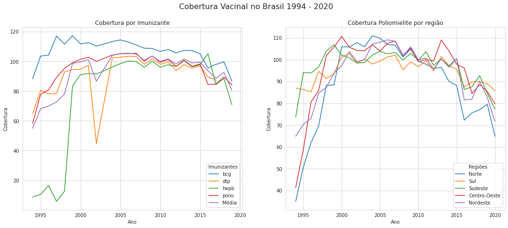
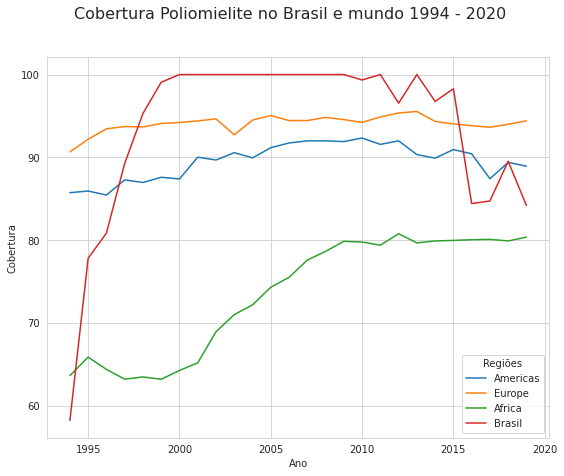
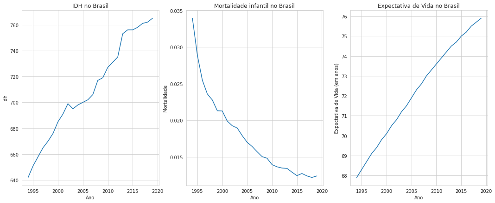

# Vaccine-immunology
Trabalho final da disciplina Ciência e Visualização de Dados em Saúde.

<strong>Projeto</strong> - Estudo da evolução da cobertura vacinal para imunização e erradicação de doenças infecciosas.

<strong>Project</strong> - Study of the evolution of the vaccine coverage for immunization and eradication infectious diseases.

~~~
├── README.md          <- apresentação do projeto
│
├── data
│   ├── processed      <- dados finais usados para a modelagem
│   └── raw            <- dados originais sem modificações
│
├── notebooks          <- Jupyter notebooks
│
├── images             <- iamgens geradas durante o desenvolvimento do projeto
    └── README.md      <- instruções básicas de instalação/execução
~~~

# Apresentação

O presente projeto foi originado no contexto das atividades da disciplina de pós-graduação Ciência e Visualização de Dados em Saúde, oferecida no primeiro semestre de 2021, na Unicamp.

   
Nome | RA | Especialização
----- | ----- | -----
Bruna Mezzari Carlos             | 235624 | Física Médica
Jean Antonio Ribeiro             | 265739 | Computação
Kellen Natalice Vilharva         | 235493 | Saúde
Roberto Junio de Almeida Candian | 214572 | Saúde

# Descrição Resumida do Projeto

    
   <strong>Tema do projeto:</strong> Considerando a complexa interação do sistema imunológico com diversos patógenos, a utilização das vacinas para prevenir doenças infecciosas, representa um grande triunfo para a ciência. A imunização por meio das vacinas, permitiram redução significativa de incidência de doenças, além da erradicação de outras. O projeto visa entender como a cobertura vacinal no Brasil evoluiu ao longo das últimas décadas, e quais os possíveis fatores que podem estar associados a essa evolução.
   
   <strong>Contexto gerador e motivação:</strong> Percepção da diminuição da cobertura vacinal ao longo dos últimos anos, cuja causa pode estar associada a diversos fatores socias, econômicos e de saúde global.
   
   <strong>Key words:</strong> 1. cobetura vacinal 2. imunização
    

# Vídeos do Projeto

## Vídeo da Proposta
> Link para vídeo de apresentação da proposta do projeto (máximo 3 minutos).

   https://youtu.be/riO6BU0K5MU

## Vídeo da Apresentação Final
> Link para vídeo da apresentação final do projeto (máximo 8 minutos). *TODOS OS MEMBROS DO GRUPO DEVEM APARECER NO VÍDEO*.

# Slides do Projeto

## Slides da Proposta
> Link para slides de apresentação da proposta do projeto.

## Slides da Apresentação Final
> Link para slides da apresentação final do projeto.

# Introdução e Referenciais de Teóricos
> Contextualização do projeto
>
> Caracterização do problema
>
> Motivação
>
> Relevância
>
> Trabalhos relacionados
>
> Indicação (bastante resumida) da análise proposta
>
> Indicação (bastante resumida) dos resultados alcançados

 O tipo de vacina mais comum é a utilização da versão atenuada do vírus ou bactéria, sendo que os primeiros indícios na história da utilização desse tipo de imunização remontam ao século 10, na China. Nesta época a aplicação se dava de forma bem diferente da que conhecemos atualmente, e somente em 1798, pela experiência do cientista Edwar Jenner, que o termo "vacina" foi criado. Por meio da observação de que trabalhadores rurais que já tinham sido acometidos pela varíola bovina não eram contaminados pela variante que afetava humanos, Edwar Jenner realizou um experimento inoculando o vírus em uma criança de oito anos de idade. Dessa forma, foi possível atestar experimentalmente a eficácia desse procedimento para a imunização. A partir de resultados satisfatórios consecutivos, o conceito da vacina foi reconhecido e generalizado para diversas doenças, sendo atualmente uma das principais e mais efetivas formas de imunização e prevenção de doenças no mundo.

Por meio da vacinação, doenças como a varíola, a poliomielite, o sarampo e a rubéola foram erradicadas nas últimas décadas no Brasil. Contudo, o sucesso das campanhas de vacinação pode ser uma das causas do surgimento de movimentos antivacina que podem levar a uma queda da cobertura vacinal. Adultos e possíveis idosos da geração atual, que foram devidamente vacinados durante a infância, muitas vezes não tiveram contato com a realidade dessas doenças e acabam por não perceberem a importância da imunização. Apesar da baixa incidência, doenças como o sarampo ainda apresentam riscos para a sociedade, como ficou evidente após surtos durante os anos de 2018 e 2019 no Brasil e em outros países. Além desses fatores, a pandemia do COVID-19 pode estar contribuindo para essa queda na cobertura de imunização, tendo em vista o risco de contrair o coronavírus SARS-CoV-2, pelas pessoas ficarem reclusas em casa, além de postos de vacinação com horários reduzidos ou até mesmo fechados durante o ano de 2020. Sendo assim, o país pode voltar a ser acometido por doenças imunopreveníveis que estavam controladas diante do comprometimento da cobertura vacinal. Portanto, a vacinação é um tema estratégico de extrema importância ao se tratar de saúde pública e bem estar da população, sendo uma das formas de prevenção mais seguras e eficazes para redução da incidência de doenças contagiosas além de reduzir a utilização do sistema de saúde.
   

# Perguntas de Pesquisa

Como ocorreu a evolução da cobertura vacinal das vacinas obrigatórias, ao longo dos anos e regiões do Brasil? 
Quais fatores regionais ou sociais podem estar associados ao aumento ou diminuição da cobertura vacinal?

# Objetivos do Projeto
O objetivo do projeto foi de realizar primeiramente uma análise exploratória para identificar se a cobertura vacinal dos principais imunizantes realmente diminuiu ao longo dos últimos anos, e se esse comportamento é o mesmo entre as regiões do Brasil. Essa análise também foi estendida para comparar a evolução da cobertura vacinal no Brasil com demais continentes. Também tivemos como objetivo analisar a relevância da cobertura vacinal de certos imunizantes para a redução da mortalidade infantil e aumento da expectativa de vida, além de comparar a evolução do IDH brasileiro com a cobertura vacinal dos mesmos imunizantes. 

# Metodologia
> Abordagem adotada pelo projeto na busca pela resposta às perguntas de pesquisa.
> Justificar teoricamente, sempre que possível, a metodologia adotada.
<!--    Proposta de metodologia incluindo especificação de quais técnicas pretende-se explorar, tais como: aprendizagem de máquina, análise de redes, análise estatística, ou integração de uma ou mais técnicas. Para a primeira entrega, descreva de maneira mais genérica que tipo de abordagem seu grupo pretende realizar. -->
    
   O projeto será elaborado a partir do modelo CRISP-DM. Com a utilização de dados fornecidos pelas bases de dados, a modelagem será realizada por meio de gráficos, correlação entre os dados e séries temporais. Também serão utilizadas Árvore de Decisão e Métodos de Regressão para a predição de informações, ambas utilizando a linguagem de programação Python.

# Bases de Dados e Evolução

### Bases Estudadas e Adotadas
    
Database | Endereço na Web|Resumo descritivo
----- | ----- | -----
|DATASUS  | http://tabnet.datasus.gov.br/cgi/dhdat.exe?bd_pni/cpnibr.def | Departamento de informática do Sistema Único de Saúde do Brasil, o Datasus administra informações de saúde e informações financeiras. |
<!--| Bigdata  | https://bigdata.icict.fiocruz.br | Lançada em 2016, a PCDaS é uma iniciativa do Laboratório de Informação em Saúde (Lis) e do Centro de Tecnologia da Informação e Comunicação em Saúde (Ctic), ambos do Instituto de Comunicação e Informação Científica e Tecnológica em Saúde (Icict) da Fundação Oswaldo Cruz (Fiocruz), em parceria com o Laboratório Nacional de Computação Científica (LNCC), tem como objetivo desenvolver e disponibilizar Plataforma de Ciência de Dados aplicada à Saúde pública e gratuita com utilização de ferramentas open source para armazenamento, gestão, análise e disseminação de grandes quantidades de dados de saúde e seus determinantes socioambientais para pesquisadores, docentes e discentes de instituições de ensino e pesquisa, bem como gestores governamentais. |-->
Todas as tabelas, armazenadas em arquivos 'csv', possuíam a mesma quantidade de valores em cada coluna, mesmo que seja o valor 0. Contudo, na última linha de cada tabela, possui um valor representando a soma total de todos os valores da respectiva coluna. As transformações e tratamentos necesssários para obter uma nova base de dados que possa ser manipulada, de forma que se possa obter informações úteis e, posteriomente, ser analisadas, foram:
   
   * Remoção de linhas com dados categóricos, no caso, somente a última linha de todas as tabelas foram retiradas. Nessa linha, havia as representações totais de cada coluna. No caso da última célula, na coluna de nome 'Ano', seu valor é do tipo string igual a 'Total'. O restante das células, para todas as tabelas, são do tipo numérico.
   * Alguns dos valores numéricos possuiam o caracter ',' e, por isso, foram trocados pelo caracter '.'. Essa abordagem foi realizada para que a biblioteca pandas pudesse ler os dados dos arquivos 'csv' e, em seguida, manipulá-los.
   * Para muitos imunizantes não haviam dados de todos os anos (1994-2020), pois a cobertura vacinal era 0. Foram considerados para as análises somente os imunizantes com nenhum ou poucos valores nulos. Para alguns anos e imunizantes, a cobertura vacinal é maior do que 100% (mais de 100% da população alvo estimada foi imunizada).

  Um formulário básico que deve ser capaz de orientar o leitor na estruturação de informações em etapas de entendimento dos dados são encontrados ([ver aqui](data/raw/vaccine-immunology/notatecnicaCobertura.pdf)) e ([ver aqui](data/raw/vaccine-immunology/info.txt)).
  
  A descrição de todas as operações realizadas, para reestruturação, e analíses realizadas durante o desenvolvimento deste projeto, podem ser conferidas no notebook gerador dos agrupamentos ([ver aqui](notebooks/E2_vaccine_immunology.ipynb)).
  
  Na análise exploratória inicial, foram feitos gráficos de correlação, boxplot e evolução temporal: 
   
   * Cobertura vacinal no Brasil 1994 - 2020:

   <figure>
	
	<!--<figcaption>Legenda para a imagem impressionante</figcaption>-->
   </figure>
   
   <figure>
	
	<!--<figcaption>Legenda para a imagem impressionante</figcaption>-->
   </figure>
    
 
   * Cobertura BCG no Brasil 1994 - 2020:
   
   <figure>
	
	<!--<figcaption>Legenda para a imagem impressionante</figcaption>-->
   </figure>
   

   * Cobertura Poliomielite no Brasil 1994 - 2020:
   
   <figure>
	
	<!--<figcaption>Legenda para a imagem impressionante</figcaption>-->
   </figure>
   
   <figure>
	
	<!--<figcaption>Legenda para a imagem impressionante</figcaption>-->
   </figure>
   
   
   
   * Cobertura Hepatite B no Brasil 1994 - 2020:

   <figure>
	
	<!--<figcaption>Legenda para a imagem impressionante</figcaption>-->
   </figure>
   
   
   * Cobertura DTP no Brasil 1994 - 2016 (sem info no ano de 2003):

   <figure>
	
	<!--<figcaption>Legenda para a imagem impressionante</figcaption>-->
   </figure>
   
A partir destas análises exploratórias, foi possível identificar que há um movimento de queda das coberturas vacinais a partir dos anos de 2018-2019 para todos os imunizantes considerados. Essa queda ocorre logo depois de um grande movimento de ascensão entre os anos de 1994 e 2015-2016. Foi possível observar também que todas as regiões possuem médias maiores que 80 para todos os imunizantes, sendo que os municípios de extrema pobreza possuem em geral as menores médias e a região de maior média varia entre os imunizantes. A variação de valores das coberturas é maior nas regiões Norte, Nordeste, Amazônia Legal e municípios de extrema pobreza. Um comportamento similar entre essas regiões já era esperado, visto a proximidade geográfica e maior intersecção entre elas (Amazônia Legal e Norte, por exemplo). A partir dos gráficos de correlação foi possível identificar melhor as tendências de similaridade obtidas com os gráficos de boxplot. Novamente temos uma forte correlação entre Norte, Nordeste, Amazônia Legal, municípios de extrema pobreza e também o Semiárido. As regiões com menores correlações foram Sul e Norte, Sul e Centro-Oeste e Sul e Amazônia Legal para o imunizante BCG. Para os demais imunizantes, não houve nenhuma correlação abaixo de 0.5, e as tendências foram similares.
   
   

Database | Endereço na Web|Resumo descritivo
----- | ----- | -----
THE GLOBAL HEALTH OBSERVATORY | https://www.who.int/data/gho/data/themes/immunization | Iniciativa da Organização Mundial da Saúde para compartilhar dados sobre saúde global, incluindo estatísticas por país e informações sobre doenças específicas e medidas de saúde. O site da GHO é organizado em torno de temas. Para cada tema, as principais estatísticas são apresentadas na página da Web associada, e dados e relatórios mais detalhados estão disponíveis para download.
        
Com essa base de dados, foi possível obter os dados de cobertura vacinal de diversos imunizantes dos anos de 1980 a 2019. Foram pesquisados dados das vacinas BCG, Poliomielite, Hepatite B e DTP. A base fornece os dados por país, mas os datasets também possuem uma coluna indicando o continente ou macro-região global a qual o país pertence. Como o objetivo da análise era comparar o Brasil com índices gerais, escolhemos trabalhar com a média de cobertura entre continentes (países da Ásia e Oceania estavam divididos em regiões menores, então fizemos a média somente para Americas, África e Europa). Entre os dados escolhidos não haviam dados faltantes, e os valores de cobertura vacinal (porcentagem da população-alvo corretamente imunizada) variam de 1 a 100.

A análie exploratória foi feita de forma integrada com os dados do DATASUS (item Integração entre Bases)

    

Database | Endereço na Web|Resumo descritivo
----- | ----- | -----
HDR | http://hdr.undp.org/en/data | Dataset com compilado de dados obtidos de diversas fontes para desenvolvimento em termos de pesquisa e análise, debate econômico, opções de políticas e advocacy. Nessa base são fornecidas informações sobre saúde, economia, educação e índices como o idh de diversos países do mundo.

Com essa base de dados, foi possível obter indicadores sociais e de saúde do Brasil para diferentes anos. Muitos dos indicadores escolhidos não possuem registros em todos os anos considerados pela base de dados, ou possuem somente registros periódicos (a cada 5 anos). Dos possíveis indicadores que poderiam estar relacionados com a cobertura vacinal e que possuíam registros no período 1994-2019, escolhemos para analisar os seguintes:

 * IDH : medida de desenvolvimento humano, em especial nos setores de educação (education index), renda (PIB per capita) e longevidade (expectativa de vida). Varia entre 0 e 100, sendo 100 correspondente a um país bastante desenvolvido. 
 * Education index: leva em conta o número médio de anos escolares de pessoas com mais de 25 anos. Varia entre 0 e 1, sendo que um índice 1 indicaria que todos os adultos acima de 25 anos receberam 18 ou mais anos de educação formal.

A análie exploratória foi feita integrada com os dados do DATASUS (item Integração entre Bases)

### Integração entre Bases e Análise Exploratória

 * Integração entre a base GLOBAL HEALTH OBSERVATORY e DATASUS: nessa etapa da análise, integramos as médias de cobertura vacinal dos continentes às coberturas vacinais do Brasil e regiões do Brasil (Sul, Norte, Sudeste, ...), criando datasets 'imuno_mundo_br' com todos os dados de 1994 a 2019. Como a cobertua vacinal na base de dados internacional assume valores de 1 a 100, os valores de cobertura acima de 100 oriundos da base Brasileira foram redefinidos como 100. Na análise exploratória inicial, foram feitos gráficos de correlação, boxplot e evolução temporal, como exemplificado a seguir

   <figure>
	
	<!--<figcaption>Legenda para a imagem impressionante</figcaption>-->
   </figure>
   
   <figure>
	
	<!--<figcaption>Legenda para a imagem impressionante</figcaption>-->
   </figure>
   
   O gráfico de boxplot para a poliomielite permite identificar que as médias de cobertura vacinal são similares entre Europa, Americas e Brasil sendo que a África possue a menor média e o Brasil, a maior. Entretanto, a variação de valores para o Brasil é alta comparada com as variações de Europa e Americas, e similar à varição da África. Essa variação maior já era esperada visto que os dados dos continentes representam médias sobre os países, mas ainda assim o continente Africano apresentou grande variação. Esse comportamento é refletido nas correlações, onde temos que o Brasil possue correlações altas com Europa e Americas, e correlação baixa com a África. No gráfico de evolução temporal, é interessante observar o comportamento de ascensão da cobertura vacinal no Brasil entre 1995-2000 em comparação com os demais. A variação para esse período é de mais de 40 para o Brasil, enquanto que para os continentes não passa de 10. Podemos ver também que o comportamento de queda dos últimos anos ocorre com maior força somente no Brasil.
  
   
 * Integração entre a base HDR e DATASUS: nessa etapa da análise, integramos o índice IDH(obtido da base HDR) aos dados de número total de óbitos de crianças abaixo de 1 ano, número de nascidos vivos, expectativa de vida (em anos) e cobertura vacinal dos imunizantes BCG, Poliomielite, Hepatie B, DTP e Febre Amarela (obtidos do DATASUS) no período de 1994-2019. Na base HDR, as linhas representam os países e as colunas, os anos. Para manter a formatação utilizada dos demais dataframes, invertemos as matrizes de dados oriundas da HDR para o formato ano x país e, em sequência, selecionamos somente a coluna com os dados do Brasil. Para gerar os dados de mortalidade infantil realizamos o seguinte cálculo para cada ano, de acordo com a referência (https://www.scielo.br/j/rsp/a/xrSd7kCyTCB9yrpT6FmJ9Kf/?lang=pt|)
 Mortalidade (de crianças abaixo de 1 ano) = Número total de óbitos (de crianças abaixo de 1 ano)/ Número de nascidos vivos 
 
 Na análise exploratória inicial, foram feitos gráficos de correlação, evolução temporal e scatter como exemplificado a seguir

   <figure>
	
	<!--<figcaption>Legenda para a imagem impressionante</figcaption>-->
   </figure>
   
   <figure>
	
	<!--<figcaption>Legenda para a imagem impressionante</figcaption>-->
   </figure>
   
   <figure>
	
	<!--<figcaption>Legenda para a imagem impressionante</figcaption>-->
   </figure>

A partir do gráfico de correlação e dos gráficos temporais foi possível identificar uma correlação fortemente negativa entre mortalidade infantil e expectativa de vida, bem como correlações fortemente positiva entre IDH e expectativa de vida e negativa entre IDH e mortalidade infantil, como esperado. As correlações com a cobertura vacinal da poliomielite não são tão fortes, mas indicam que há correspondência positiva com o IDH e expectativa de vida, e negativa com mortalidade infantil. A partir dos gráficos de scatter podemos entender porque a correlação da cobertura vacinal não é tão forte. Apesar de haver uma tendência de decréscimo na mortalidade e aumento do IDH com o aumento da cobertura vacinal, exitem pontos de alto IDH e baixa mortalidade correspondentes a valores menores de cobertura vacinal. Esses pontos podem estar em duas categorias, podendo ser outliers (pontos calculados erroneamente) ou serem correspondentes aos últimos anos, onde houve decréscimo na cobertura da poliomielite.

A descrição de todas as operações realizadas nesta etapa também podem ser conferidas no notebook gerador dos agrupamentos ([ver aqui](notebooks/E2_vaccine_immunology.ipynb)).   

# Análises Realizadas
> Descrição detalhada das análises realizadas.
>
>
>
>Relate aqui também a evolução do projeto: possíveis problemas enfrentados e possíveis mudanças de trajetória. Relatar o processo para se alcançar os resultados é tão importante quanto os resultados.
>
>
>
> Nesta seção ou na seção de Resultados podem aparecer destaques de código como indicado a seguir. Note que foi usada uma técnica de highlight de código, que envolve colocar o nome da linguagem na abertura de um trecho com `~~~`, tal como `~~~python`.
>
> Os destaques de código devem ser trechos pequenos de poucas linhas, que estejam diretamente ligados a alguma explicação. Não utilize trechos extensos de código. Se algum código funcionar online (tal como um Jupyter Notebook), aqui pode haver links. No caso do Jupyter, preferencialmente para o Binder abrindo diretamente o notebook em questão.

~~~python
df = pd.read_excel("/content/drive/My Drive/Colab Notebooks/dataset.xlsx");
sns.set(color_codes=True);
sns.distplot(df.Hemoglobin);
plt.show();
~~~

# Ferramentas utilizadas

   
   O projeto foi elaborado com auxílio de gráficos, séries temporais e da linguagem de programação Python.
    
Ferramenta | Endereço na Web | Resumo descritivo e utilização
----- | ----- | -----
Google Colab 	 | https://colab.research.google.com | Lista de células que podem conter textos explicativos ou códigos executáveis e suas respectivas saídas.
Jupyter Notebook | https://jupyter.org/ | Documento que permite execução de rotinas usuais de programação e documentação de todo o processo de produção do código.
Matplotlib   	 | https://matplotlib.org            | Biblioteca do _Python_ para criação de gráficos e visualizações de dados.
Numpy        	 | https://numpy.org                 | Biblioteca do _Python_ orientada a operação de vetores e matrizes multidimensionais.
Pandas      	 | https://pandas.pydata.org         | Biblioteca do _Python_ orientada a manipulação e análise de dados.
Python 3.8.3 	 | https://www.python.org            | Linguagem de programação de propósito geral. Utilizada para a predição dos dados.

# Resultados
> Descrição dos resultados mais importantes obtidos.
>
> Apresente os resultados da forma mais rica possível, com gráficos e tabelas. Mesmo que o seu código rode online em um notebook, copie para esta parte a figura estática. A referência a código e links para execução online pode ser feita aqui ou na seção de Análises Realizadas (o que for mais pertinente).

# Discussão dos resultados
> Discussão dos resultados. Relacionar os resultados com as perguntas de pesquisa ou hipóteses avaliadas.
>
> A discussão dos resultados também pode ser feita opcionalmente na seção de Resultados, na medida em que os resultados são apresentados. Aspectos importantes a serem discutidos: É possível tirar conclusões dos resultados? Quais? Há indicações de direções para estudo? São necessários trabalhos mais profundos?

# Conclusões e Lições aprendidas
> Destacar as principais conclusões obtidas no desenvolvimento do projeto.
>
> Destacar os principais desafios enfrentados.
>
> Principais lições aprendidas.

# Trabalhos futuros
> O que poderia ser melhorado se houvesse mais tempo?

# Cronograma
    
<!--Tarefas | março | abril | maio | junho | 
----- | ----- | ----- | ----- | ----- | 
Descrição inicial do projeto            | X |   |   |   |
Levantamento dos dados                  | X | X | X |   |
Análise dos dados                       |   | X | X |   |
Digitalização do projeto                |   |   | X | X | 
Entrega e apresentação final do projeto |   |   | X | X | -->

# Referências

[1] **Brito WI, Souto FJD.** Universal hepatitis A vaccination in Brazil: analysis of vaccination coverage and incidence five years after program implementation. Revista Brasileira de Epidemiologia = Brazilian Journal of Epidemiology. 2020;23:e200073. DOI: 10.1590/1980-549720200073. https://www.scielo.br/j/rbepid/a/KhgLqWW78SL4mzwqT3tJHLn/?lang=en
